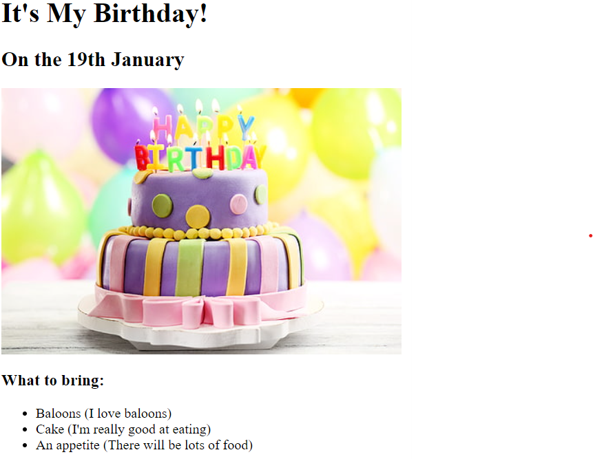

# html-portfolio
Rohit's Portfolio - A personal portfolio website to showcase my work as a web developer. This repository includes HTML files for various projects, images for project previews, and links to detailed project pages, as well as sections about me and how to contact me.

Welcome to my personal portfolio website! This site is designed to showcase my work as a web developer. Below you'll find links to various projects I've worked on, along with screenshots and descriptions.

## Projects

### Movie Ranking Project
- **Description**: My Favourite Top 3 Movies.
- **Link**: [View Project](./public/movie-ranking.html)
- **Screenshot**:
  

### Birthday Invite Project
- **Description**: Digital birthday invitation.
- **Link**: [View Project](./public/birthday-invite.html)
- **Screenshot**:
  

## About Me

Learn more about my background, skills, and experience. [About Me](./public/about.html)

## Contact Me

Get in touch with me for collaboration, or any inquiries. [Contact Me](./public/contact.html)

## How to Run Locally

1. Clone this repository.
2. Open the `index.html` file in a web browser to view the portfolio.

## Technologies Used

- HTML
